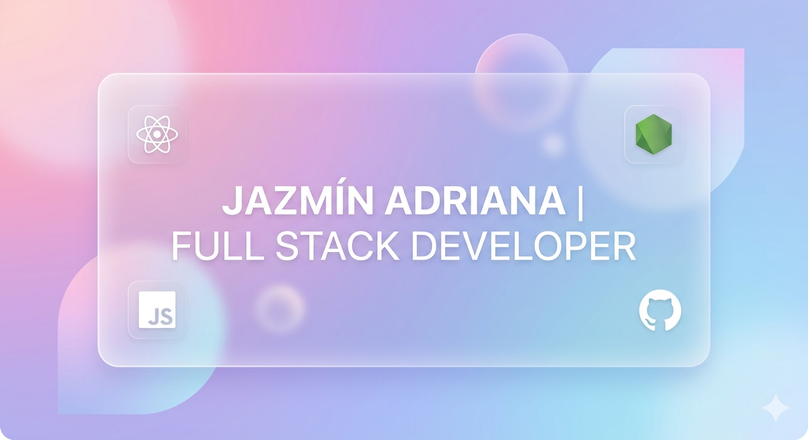

# Hi there! I'm Jazmín Adriana 👋🏻

### Full Stack Developer in training | Mexico City 🇲🇽

I am a **Junior Web Developer** focused on building scalable, aesthetic digital solutions. Currently, I am mastering the **MERN Stack** through the rigorous **Full Stack Open** curriculum (University of Helsinki), applying modern architecture principles and quality-driven development.

---

### 🚀 My Technical Focus

- **Frontend Core:** Specializing in **React + TypeScript** to build modular, strongly-typed interfaces.
- **Industry Standards:** Strict implementation of **Conventional Commits**, **BEM** methodology, and reusable component architectures.
- **UI/UX:** Passionate about modern design, exploring **Glassmorphism** interfaces with a professional yet "girly" aesthetic.

### 🛠️ Tech Stack

---

### 📂 Featured Projects

| Project                    | Description                                                                | Demo                                                                                       |
| :------------------------- | :------------------------------------------------------------------------- | :----------------------------------------------------------------------------------------- |
| **Glow & Flow**            | (In Progress) Management app for fitness enthusiasts (React + Vite).       | [Live Demo](https://jazminadriana.github.io/ticket-generator/)                             |
| **Phonebook App**          | Full Stack integration featuring Node, Express, and MongoDB.               | [Repo](https://github.com/jazminadriana/fullstackopen-exercises/tree/main/part2/phonebook) |
| **Interactive Calculator** | Complex logic implementation using `mathjs` and advanced state management. | [Live Demo](https://jazminadriana.github.io/react-calculator/)                             |

---

### 🎓 Education & Certifications

- **Full Stack Open (U. of Helsinki):** Successfully completed Parts 0-2 (React, server communication).
- **freeCodeCamp:**
  - 📜 [Responsive Web Design](https://www.freecodecamp.org/certification/jazcode/responsive-web-design)
  - 📜 [B1 English for Developers](https://www.freecodecamp.org/certification/jazcode/b1-english-for-developers)

---

### 🧘🏻‍♀️ Beyond the Code

Outside of web development, I enjoy weight training and practicing Pole Fitness—disciplines that remind me that real progress is built with patience, discipline, and consistency, much like programming.

I am inspired by the idea of becoming a better version of myself every day: stronger, more creative, and ready to build projects that make an impact. I love bridging the gap between the tech world and personal well-being, aesthetic design, and continuous learning.

Currently, I am not just building my skills as a Full Stack Developer, but also a lifestyle centered on growth, holistic health, and creative ambition. 💻🖤

---

### Let's Connect

  

